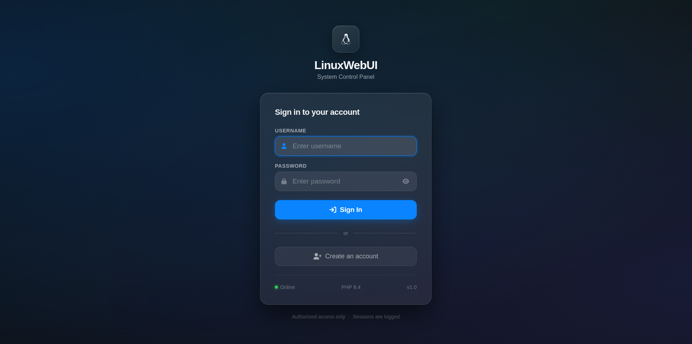
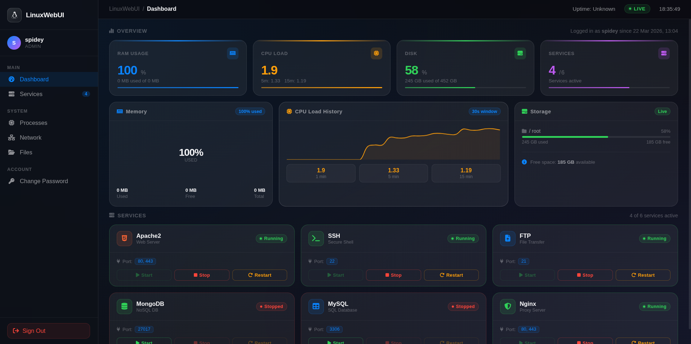

# 🐧 LinuxWebUI

> **⚠️ Beta Release — v0.1.0-beta**  
> This project is under active development. Expect bugs, breaking changes, and incomplete features. Contributions and feedback are welcome.

A clean, fast, Apple-inspired web interface for monitoring and controlling your Linux server — built with pure PHP, no frameworks, no bloat.


---

## Screenshots

> Dashboard with live RAM, CPU, Disk monitoring and service control cards.





---

## Features

- **Live System Stats** — RAM, CPU load, Disk usage, Uptime — updates every 3 seconds
- **Service Control** — Start, Stop, Restart services with one click (Apache2, SSH, FTP, MongoDB, MySQL, Nginx)
- **Real-time Charts** — RAM donut chart, CPU sparkline history, Disk usage bars
- **User Auth** — Secure login and registration with bcrypt password hashing
- **Apple-inspired UI** — Frosted glass design, system font, smooth animations — loads fast
- **Session Security** — PHP sessions with login time tracking
- **Responsive** — Works on desktop and mobile

---


## Requirements

- Linux (Debian/Ubuntu/Kali recommended)
- Apache2
- PHP 8.0+
- `gcc` (for service control binary)
- `systemctl` (systemd-based distros only)

---

## Installation

### 1. Clone the repository

```bash
git clone https://github.com/yourusername/LinuxWebUI.git
cd LinuxWebUI
```

### 2. Copy to Apache webroot

```bash
sudo cp -r . /var/www/html/
sudo chown -R www-data:www-data /var/www/html/
sudo chmod 640 /var/www/html/config/users.json
```

### 3. Build the service control binary

```bash
sudo gcc svc-control.c -o /tmp/svc-control
sudo chown root:root /tmp/svc-control
sudo chmod 4755 /tmp/svc-control
```

### 4. Configure sudoers (optional — for systemctl access)

```bash
sudo bash -c 'cat > /etc/sudoers.d/www-data-systemctl << EOF
Defaults:www-data !requiretty
www-data ALL=(root) NOPASSWD: /tmp/svc-control
EOF'
sudo chmod 440 /etc/sudoers.d/www-data-systemctl
```

### 5. Restart Apache

```bash
sudo systemctl restart apache2
```

### 6. Open in browser

```
http://localhost/
```

Register your first account and you're in.

---

## Project Structure

```
LinuxWebUI/
├── index.php              # Redirects to login
├── login.php              # Login page
├── register.php           # Registration page
├── dashboard.php          # Main dashboard
├── logout.php             # Session destroy
│
├── api/
│   ├── stats.php          # Returns RAM/CPU/Disk JSON
│   └── service.php        # Service start/stop/restart API
│
├── includes/
│   ├── auth.php           # Session guard
│   └── functions.php      # getRAM, getCPU, getDisk, getUptime
│
├── config/
│   └── users.json         # User store (bcrypt hashed passwords)
│
└── docker/                # Docker setup (dev only)
    ├── Dockerfile
    └── php.ini
```

---

## Services Monitored

| Service | Port | Description |
|---|---|---|
| Apache2 | 80, 443 | Web Server |
| SSH | 22 | Secure Shell |
| FTP (vsftpd) | 21 | File Transfer |
| MongoDB | 27017 | NoSQL Database |
| MySQL | 3306 | SQL Database |
| Nginx | 80, 443 | Proxy Server |

To add more services — edit the `SERVICES` array in `dashboard.php` and the whitelist in `api/service.php`.

---

## Security Notes

- All passwords are hashed with `bcrypt` (PHP `PASSWORD_BCRYPT`)
- Service control uses a whitelisted C binary — arbitrary commands are not possible
- Sessions use `httponly` cookies
- All user input is validated and sanitized with `htmlspecialchars()`
- `open_basedir` is configurable via `docker/php.ini`

> **This project is intended for local network / homelab use. Do NOT expose it to the public internet without adding HTTPS and additional hardening.**

---

## Known Issues (Beta)

- Service status detection uses port checking — may show false positives if another process uses the same port
- No HTTPS support yet (planned for v0.2.0)
- No role-based access control yet (all users have equal access)
- Mobile sidebar not yet implemented
- Processes, Network, Files pages are UI placeholders only

---


## Contributing

Pull requests are welcome. For major changes please open an issue first.

```bash
git checkout -b feature/your-feature
git commit -m "Add your feature"
git push origin feature/your-feature
```

---


## License

MIT License — free to use, modify, and distribute.

---

> **Beta disclaimer:** This software is provided as-is. It is not production-ready. Use at your own risk on trusted networks only.